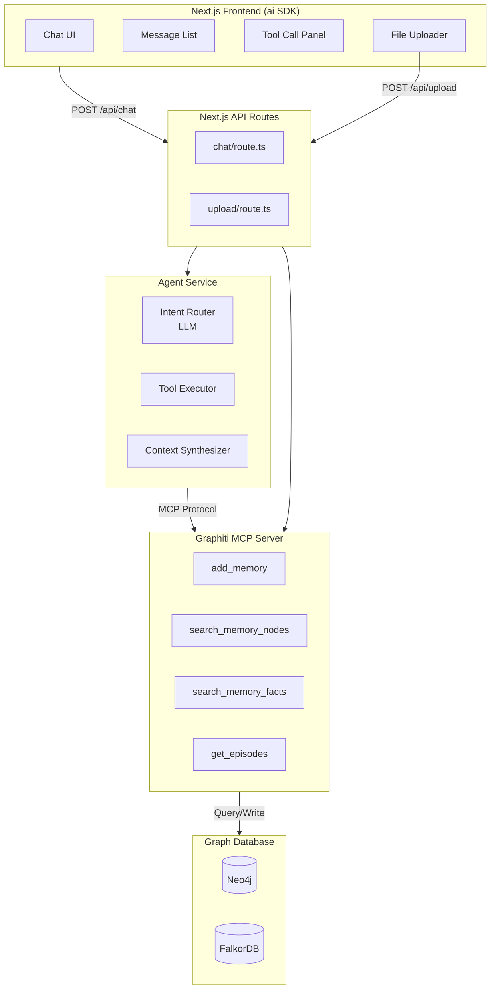
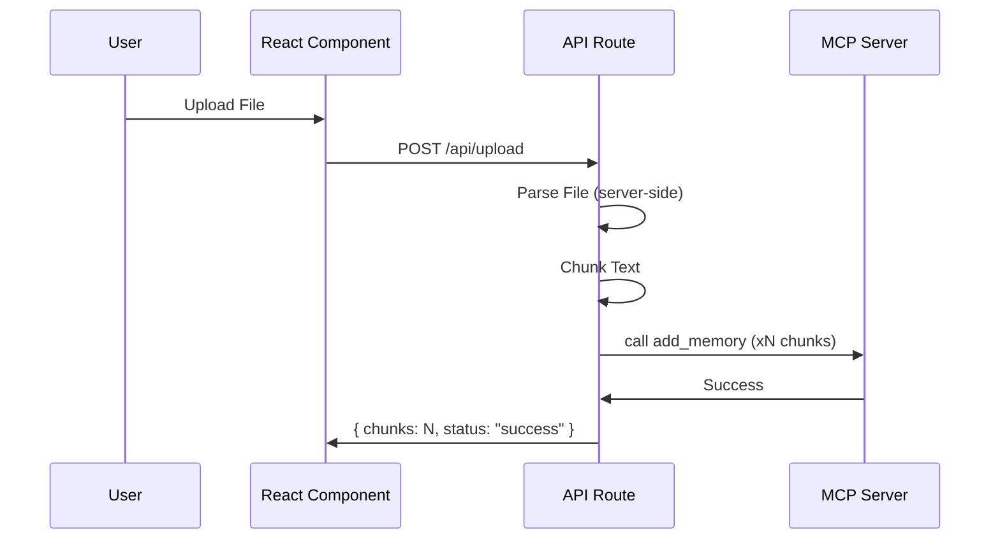

# MCP Chat Agent - Implementation Plan

## 1. Overview

Build a web-based chat application using **Next.js + Vercel AI SDK** that connects to the Graphiti MCP server. The AI agent automatically determines which tools to invoke based on user queries, collects context from the knowledge graph, and provides comprehensive answers. Users can optionally upload documents (PDF, TXT, DOCX, MD) to build a private knowledge base.

## 2. Architecture



## 3. Technology Stack

| Component | Technology | Rationale |
|-----------|------------|-----------|
| Frontend | Next.js 14 (App Router) | React framework with server components |
| AI SDK | [Vercel AI](https://github.com/vercel/ai) | React hooks for streaming chat, tool calls |
| MCP Client | `@modelcontextprotocol/sdk` | TypeScript MCP client |
| LLM Client | `ai` SDK (OpenAI/Anthropic) | Built-in tool call support |
| Agent Framework | Vercel AI `useChat` + custom tools | ReAct pattern with tool calls |
| Styling | Tailwind CSS | Utility-first styling |
| Document Parser | Server-side (pdf-parse, mammoth) | Process uploads via API |
| Language | TypeScript | Full-stack type safety |

## 4. MCP Tools Available

| Tool | Purpose | Parameters |
|------|---------|------------|
| `add_memory` | Add episodes to knowledge graph | name, episode_body, group_id, source, source_description, uuid |
| `search_nodes` | Search entities/nodes | query, group_ids, max_nodes, entity_types |
| `search_memory_facts` | Search edges/facts | query, group_ids, max_facts, center_node_uuid |
| `get_episodes` | Retrieve episodes by group | group_ids, max_episodes |
| `delete_episode` | Delete an episode | uuid |
| `clear_graph` | Clear graph data | group_ids |
| `get_status` | Server status | - |

## 5. Agent Design

### 5.1 ReAct Agent Pattern

```mermaid
flowchart LR
    Q[User Query] --> IC[Intent Classification]
    IC --> TS[Tool Selection]
    TS --> ET[Execute Tool(s)]
    ET --> CS[Context Synthesis]
    CS --> FR[Final Response]
```

### 5.2 Tool Selection Logic

**Step 1: Intent Classification**
- Parse user query to determine intent
- Intents: `search`, `add_memory`, `add_document`, `get_info`, `delete`, `general_qa`

**Step 2: Tool Mapping**

| Intent | Primary Tool(s) | Fallback |
|--------|-----------------|----------|
| Find information | search_nodes, search_memory_facts | - |
| Store information | add_memory | - |
| Upload document | add_document → add_memory | - |
| List history | get_episodes | - |
| Delete data | delete_episode, clear_graph | - |
| General question | search + synthesize | search_nodes |

**Step 3: Parameter Extraction**
- Extract group_id (default: "default")
- Extract query/names from natural language
- Handle ambiguous inputs via clarification

### 5.3 Context Collection

```python
async def collect_context(tools: list[str], params: dict) -> dict:
    results = {}
    for tool in tools:
        result = await mcp_client.call_tool(tool, params)
        results[tool] = result
    return results
```

### 5.4 Response Generation

```python
async def generate_response(query: str, context: dict) -> str:
    prompt = f"""Given the user query: {query}
    And the collected context: {context}
    Provide a clear, helpful answer."""
    return await llm.complete(prompt)
```

## 5.5 Document Upload & Processing



**Supported Formats:**
| Format | Library | Max Size |
|--------|---------|-----------|
| PDF | `pdf-parse` | 50MB |
| DOCX | `mammoth` | 25MB |
| TXT/MD | Built-in | 10MB |

**Chunking Strategy:**
- Default: 1000 chars with 200 char overlap
- Configurable chunk size
- Preserve paragraph boundaries

## 6. Implementation Phases

### Phase 1: Foundation
- [ ] Set up Next.js project with App Router
- [ ] Configure Tailwind CSS
- [ ] Set up environment variables (.env.local)
- [ ] Create base layout and theme

### Phase 2: MCP Integration
- [ ] Install MCP SDK and configure client
- [ ] Implement tool discovery
- [ ] Create MCP client wrapper class
- [ ] Connection pooling and reconnection logic

### Phase 3: Agent Logic
- [ ] Define MCP tools as AI tool definitions
- [ ] Implement tool executor
- [ ] Context synthesizer
- [ ] Streaming response handling

### Phase 4: Chat Interface
- [ ] Create chat component with `useChat`
- [ ] Message list with streaming
- [ ] Tool call visualization panel
- [ ] Loading states

### Phase 5: Document Upload
- [ ] File uploader component (react-dropzone)
- [ ] API route for upload processing
- [ ] Document parser (server-side)
- [ ] Chunking and `add_memory` pipeline
- [ ] Upload progress display

### Phase 6: Polish
- [ ] Session management (group_id)
- [ ] Error boundaries
- [ ] Mobile responsive design
- [ ] E2E tests

## 7. File Structure

```
mcp-chat-agent/
├── .env.example
├── package.json
├── tsconfig.json
├── tailwind.config.ts
├── next.config.js
├── src/
│   ├── app/
│   │   ├── layout.tsx
│   │   ├── page.tsx           # Main chat page
│   │   ├── globals.css
│   │   ├── api/
│   │   │   ├── chat/
│   │   │   │   └── route.ts   # Chat API endpoint
│   │   │   └── upload/
│   │   │       └── route.ts    # Document upload endpoint
│   │   └── components/
│   │       ├── chat/
│   │       │   ├── chat-window.tsx
│   │       │   ├── message-list.tsx
│   │       │   ├── message.tsx
│   │       │   └── tool-call-panel.tsx
│   │       ├── upload/
│   │       │   ├── file-uploader.tsx
│   │       │   └── document-list.tsx
│   │       └── ui/
│   │           ├── button.tsx
│   │           └── input.tsx
│   ├── lib/
│   │   ├── mcp-client.ts       # MCP client wrapper
│   │   ├── tools.ts            # Tool definitions
│   │   ├── agent.ts           # Agent logic
│   │   └── utils.ts
│   └── types/
│       └── index.ts           # TypeScript types
├── public/
│   └── ...
└── tests/
    ├── chat.test.tsx
    └── mcp-client.test.ts
```

## 8. Key Components

### 8.1 MCP Client (TypeScript)

```typescript
// src/lib/mcp-client.ts
import { Client } from '@modelcontextprotocol/sdk/client/index.js';
import { StreamableHTTPClientTransport } from '@modelcontextprotocol/sdk/client/streamableHttp.js';

export class MCPChatClient {
  private client: Client;
  private transport: StreamableHTTPClientTransport | null = null;

  constructor(private serverUrl: string) {
    this.client = new Client({
      name: 'mcp-chat-agent',
      version: '1.0.0',
    }, {
      capabilities: {},
    });
  }

  async connect(): Promise<void> {
    this.transport = new StreamableHTTPClientTransport(new URL(this.serverUrl));
    await this.client.connect(this.transport);
  }

  async listTools() {
    const result = await this.client.listTools();
    return result.tools;
  }

  async callTool(name: string, args: Record<string, unknown>) {
    const result = await this.client.callTool({
      name,
      arguments: args,
    });
    return result;
  }

  async close(): Promise<void> {
    await this.client.close();
  }
}
```

### 8.2 Tool Definitions for Vercel AI

```typescript
// src/lib/tools.ts
import { createTool } from 'ai';

export const mcpTools = {
  addMemory: createTool({
    description: 'Add information to the knowledge graph',
    parameters: {
      type: 'object',
      properties: {
        name: { type: 'string', description: 'Name of the episode' },
        episode_body: { type: 'string', description: 'Content to store' },
        group_id: { type: 'string', description: 'Group identifier' },
        source: { type: 'string', enum: ['text', 'document', 'chat'] },
      },
      required: ['name', 'episode_body', 'group_id'],
    },
    execute: async ({ name, episode_body, group_id, source }) => {
      return await mcpClient.callTool('add_memory', {
        name,
        episode_body,
        group_id,
        // Map 'document' or 'chat' to server-supported types
        source: source === 'document' ? 'text' : (source === 'chat' ? 'message' : 'text'),
        source_description: source === 'document' ? 'Uploaded document' : 'Chat interaction',
      });
    },
  }),

  searchNodes: createTool({
    description: 'Search for entities in the knowledge graph',
    parameters: {
      type: 'object',
      properties: {
        query: { type: 'string', description: 'Search query' },
        group_ids: { type: 'array', items: { type: 'string' } },
        max_nodes: { type: 'number', default: 10 },
      },
      required: ['query', 'group_ids'],
    },
    execute: async ({ query, group_ids, max_nodes }) => {
      return await mcpClient.callTool('search_nodes', {
        query,
        group_ids,
        max_nodes,
      });
    },
  }),

  searchFacts: createTool({
    description: 'Search for facts/edges between entities',
    parameters: {
      type: 'object',
      properties: {
        query: { type: 'string' },
        group_ids: { type: 'array', items: { type: 'string' } },
        max_facts: { type: 'number', default: 10 },
      },
      required: ['query', 'group_ids'],
    },
    execute: async ({ query, group_ids, max_facts }) => {
      return await mcpClient.callTool('search_memory_facts', {
        query,
        group_ids,
        max_facts,
      });
    },
  }),
};
```

### 8.3 Chat API Route

```typescript
// src/app/api/chat/route.ts
import { streamText } from 'ai';
import { openai } from '@ai-sdk/openai';
import { anthropic } from '@ai-sdk/anthropic';
import { mcpTools } from '@/lib/tools';

export async function POST(req: Request) {
  const { messages, groupId } = await req.json();

  // Model is configured on the backend via environment variables
  const provider = process.env.AI_PROVIDER || 'openai';
  const modelName = process.env.AI_MODEL || 'gpt-4o';
  
  const model = provider === 'openai' 
    ? openai(modelName) 
    : anthropic(modelName);

  const result = streamText({
    model,
    messages,
    tools: mcpTools,
    system: `You are a helpful assistant with access to a knowledge graph.
    Group ID: ${groupId}
    Use search tools to find information.
    Use add_memory to store important information.`,
  });

  return result.toDataStreamResponse();
}
```

### 8.4 Chat Component

```typescript
// src/app/components/chat/chat-window.tsx
'use client';

import { useChat } from 'ai/react';

export function ChatWindow({ groupId }: { groupId: string }) {
  const { messages, input, handleInputChange, handleSubmit, toolCalls, toolResults } =
    useChat({
      api: '/api/chat',
      body: { groupId },
    });

  return (
    <div className="flex flex-col h-full">
      <div className="flex-1 overflow-y-auto">
        {messages.map((m) => (
          <div key={m.id} className={m.role === 'user' ? 'user-message' : 'assistant-message'}>
            {m.content}
          </div>
        ))}
        {toolCalls.map((tc) => (
          <div key={tc.id} className="tool-call">
            Calling tool: {tc.toolName}
          </div>
        ))}
      </div>
      <form onSubmit={handleSubmit} className="flex gap-2">
        <input
          value={input}
          onChange={handleInputChange}
          placeholder="Ask something..."
          className="flex-1 p-2 border rounded"
        />
        <button type="submit" className="px-4 py-2 bg-blue-500 text-white rounded">
          Send
        </button>
      </form>
    </div>
  );
}
```

### 8.5 Document Upload API

```typescript
// src/app/api/upload/route.ts
import { NextRequest, NextResponse } from 'next/server';
import { MCPChatClient } from '@/lib/mcp-client';

export async function POST(req: NextRequest) {
  const formData = await req.formData();
  const file = formData.get('file') as File;
  const groupId = formData.get('groupId') as string;

  const text = await parseFile(file);
  const chunks = chunkText(text, 1000);

  const mcpClient = new MCPChatClient(process.env.MCP_SERVER_URL!);
  await mcpClient.connect();

  const results = await Promise.all(
    chunks.map((chunk, i) =>
      mcpClient.callTool('add_memory', {
        name: `${file.name} (chunk ${i + 1})`,
        episode_body: chunk,
        group_id: groupId,
        source: 'document',
        source_description: file.name,
      })
    )
  );

  await mcpClient.close();
  return NextResponse.json({ chunks: chunks.length, status: 'success' });
}

async function parseFile(file: File): Promise<string> {
  // Use pdf-parse, mammoth, or plain text based on file type
  // ...
}

function chunkText(text: string, size: number): string[] {
  // ...
}
```

## 11. Error Handling

| Error | Handling |
|-------|----------|
| MCP connection failed | Retry with exponential backoff, show error toast |
| Tool execution failed | Display error in tool panel, suggest alternatives |
| LLM unavailable | Show fallback message, retry button |
| Invalid file type | Show validation error before upload |
| File too large | Show size limit warning |
| Streaming interrupted | Allow resume, preserve partial messages |

| Error | Handling |
|-------|----------|
| MCP connection failed | Show reconnect button, retry logic |
| Tool execution failed | Display error, suggest alternatives |
| LLM unavailable | Fallback to template responses |
| Invalid parameters | Clarify with user |

## 12. Testing Strategy

```typescript
// tests/mcp-client.test.ts
import { describe, it, expect, vi, beforeEach } from 'vitest';
import { MCPChatClient } from '@/lib/mcp-client';

vi.mock('@modelcontextprotocol/sdk/client', () => ({
  Client: vi.fn().mockImplementation(() => ({
    connect: vi.fn(),
    listTools: vi.fn(),
    callTool: vi.fn(),
    close: vi.fn(),
  })),
}));

describe('MCPChatClient', () => {
  let client: MCPChatClient;

  beforeEach(() => {
    client = new MCPChatClient('http://localhost:8000/mcp');
  });

  it('should connect to MCP server', async () => {
    await client.connect();
    expect(client.listTools).toBeDefined();
  });
});

// tests/chat.test.tsx
import { render, screen, fireEvent } from '@testing-library/react';
import { ChatWindow } from '@/app/components/chat/chat-window';

describe('ChatWindow', () => {
  it('should render chat input', () => {
    render(<ChatWindow groupId="test-group" />);
    expect(screen.getByPlaceholderText('Ask something...')).toBeInTheDocument();
  });
});
```

## 13. Dependencies

```json
// package.json
{
  "name": "mcp-chat-agent",
  "version": "1.0.0",
  "private": true,
  "scripts": {
    "dev": "next dev",
    "build": "next build",
    "start": "next start",
    "lint": "next lint"
  },
  "dependencies": {
    "ai": "^4.0.0",
    "@ai-sdk/openai": "^1.0.0",
    "@modelcontextprotocol/sdk": "^1.0.0",
    "next": "14.2.0",
    "react": "^18.3.0",
    "react-dom": "^18.3.0",
    "react-dropzone": "^14.2.0",
    "lucide-react": "^0.400.0",
    "clsx": "^2.1.0",
    "tailwind-merge": "^2.3.0"
  },
  "devDependencies": {
    "@types/node": "^20.0.0",
    "@types/react": "^18.3.0",
    "@types/react-dom": "^18.3.0",
    "typescript": "^5.0.0",
    "tailwindcss": "^3.4.0",
    "postcss": "^8.4.0",
    "autoprefixer": "^10.4.0",
    "eslint": "^8.0.0",
    "eslint-config-next": "14.2.0"
  }
}
```

## 14. Running the Application

```bash
# Install dependencies
npm install

# Development
npm run dev

# Build
npm run build

# Production
npm start

# Docker
docker build -t mcp-chat-agent .
docker run -p 3000:3000 --env-file .env.local mcp-chat-agent
```

```bash
# .env.local
MCP_SERVER_URL=http://localhost:8000/mcp
AI_PROVIDER=openai
AI_MODEL=gpt-4o
OPENAI_API_KEY=sk-...
ANTHROPIC_API_KEY=sk-ant-...
```

## 15. Future Enhancements

- [ ] WebSocket support for real-time updates
- [ ] Streaming responses (LLM + tool execution)
- [ ] Multi-user sessions with authentication
- [ ] Tool chaining (execute B based on A's result)
- [ ] Memory persistence across sessions
- [ ] Custom tool definitions
- [ ] Voice input support

## 16. Security Considerations

- API key management via environment variables
- Input sanitization for LLM prompts
- Rate limiting on tool execution
- Session isolation
- No sensitive data logging

---

**Owner:** Development Team  
**Priority:** High  
**Estimated Effort:** 2-3 weeks
